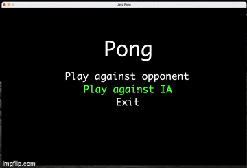

# Java Pong

Java Pong is a first game attempt. All written using Java Swing



## Build

```bash
mvn clean package
```

## Usage

From your target folder
```bash
java -jar JavaPong-1.0-jar-with-dependencies.jar
```

## Contributing
Pull requests are welcome. For major changes, please open an issue first to discuss what you would like to change.

## License
[GPL 2.0](https://choosealicense.com/licenses/gpl-2.0/)
